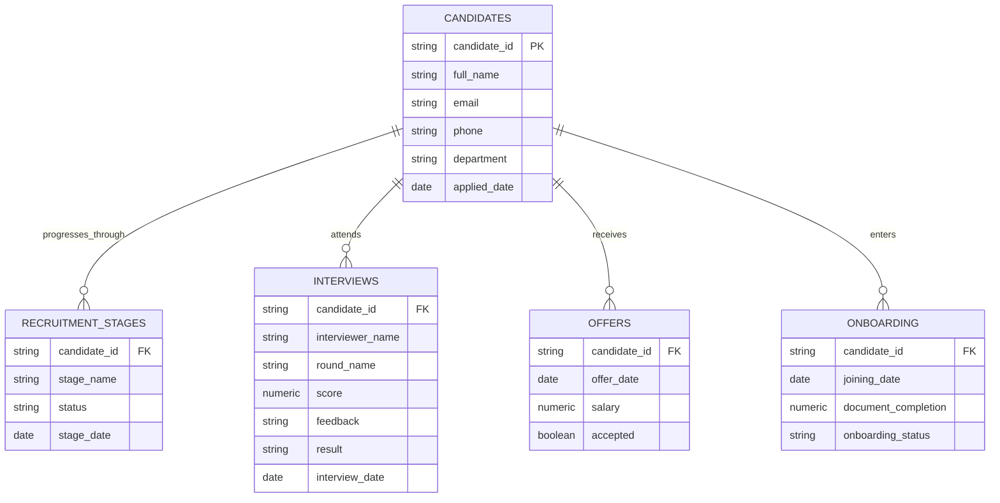

# HirePulse Column Relationships

## Relationship Model

## Column-Level Relationships

| Relationship | Source column | Target column | Meaning |
|---|---|---|---|
| Candidate to stages | `candidates.candidate_id` | `recruitment_stages.candidate_id` | One candidate can have many stage events |
| Candidate to interviews | `candidates.candidate_id` | `interviews.candidate_id` | One candidate can have zero or many interviews |
| Candidate to offers | `candidates.candidate_id` | `offers.candidate_id` | One candidate can have zero or many offers; current data has one or zero |
| Candidate to onboarding | `candidates.candidate_id` | `onboarding.candidate_id` | One candidate can have zero or one onboarding record in the current model |
| Application to hiring duration | `candidates.applied_date` | `processed_candidates.hiring_duration_days` | Start date for the elapsed hiring calculation |
| Stage joining to derived joining | `recruitment_stages.stage_date` where `stage_name = Joined` | `processed_candidates.joined_date` | Fallback joining date when onboarding date is absent |
| Onboarding joining to derived joining | `onboarding.joining_date` | `processed_candidates.joined_date` | Preferred joining date in the current feature engineering logic |
| Offer acceptance to derived flag | `offers.accepted` | `processed_candidates.offer_acceptance_flag` | Missing acceptance becomes 0; accepted becomes 1 |
| Joining presence to derived flag | `processed_candidates.joined_date` | `processed_candidates.joined_flag` | Non-null joined date becomes 1, otherwise 0 |

## Integrity Rules

- Every child-table `candidate_id` should exist in `candidates.candidate_id`.
- Source dates should be valid dates and should not precede the application date without an explicit exception.
- `stage_name` should use the controlled values in `src/config.py`.
- `status` should use the allowed recruitment-stage statuses.
- `onboarding_status` should use the allowed onboarding statuses.
- A candidate may have no interview, offer, or onboarding row because those are optional lifecycle events.
- `processed_candidates.csv` is candidate-grain output and should contain at most one row per `candidate_id`.

## Current Data Coverage

The current sample contains 100 candidates, 470 stage events, 80 interview records, 70 offers, and 50 onboarding records. All observed child-table candidate IDs match the candidate master IDs. The workflow produces 100 candidate-level output rows.
